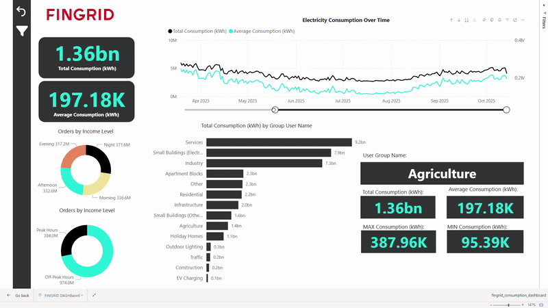

# 🔌 Finnish Household Electricity Consumption Analysis 2025

> Comprehensive analysis of Finnish electricity consumption patterns using **Microsoft Fabric**, **Spark SQL**, and **Power BI Direct Lake**

---

## 📊 Project Overview

This project analyzes **38.02 billion kWh** of electricity consumption data from Fingrid (Finland's transmission system operator), covering **10 months** of hourly consumption patterns across **14 user groups**.

### Key Achievements
- 🏗️ Implemented **medallion architecture** (Bronze-Silver-Gold layers)
- ⚡ **Direct Lake** mode for real-time analytics
- 📈 Interactive Power BI dashboard with drill-down capabilities
- 🔧 Solved **major technical challenges** independently
- 📝 Comprehensive documentation

---

## 🎯 Business Insights

### Top Consumers
1. **Services** - 9.2bn kWh (24%)
2. **Small Buildings (Electric Heat)** - 7.9bn kWh (21%)
3. **Industry** - 7.3bn kWh (19%)

### Consumption Patterns
- **Peak Hours:** 30.5% of total load
- **Off-Peak Hours:** 69.5% of total load
- **Trend:** Gradual decline from winter to fall

### User Groups Analyzed
14 categories from residential apartments to EV charging stations

---

## 🏗️ Architecture

Data Source Layer:                       
Fingrid Open Data API (Dataset 360)           

↓

Cloud Platform: Microsoft Fabric

Lakehouse (Delta Lake)

Notebooks (Spark SQL)

Pipelines (Data Integration)

Semantic Model (Direct Lake)

↓

Visualization:

Power BI Service
Interactive Dashboard with Real-Time Data

### Technology Stack
- **Cloud Platform:** Microsoft Fabric
- **Data Storage:** Delta Lake (Parquet format)
- **Transformation:** Spark SQL
- **Data Model:** Star Schema (3 dimensions, 1 fact)
- **Visualization:** Power BI Service
- **Connection Mode:** Direct Lake

---

## 🛠️ Challenges Solved

| Challenge | Solution | Impact |
|-----------|----------|--------|
| **API Authentication** | Implemented proper REST API authentication with pagination | Successfully extracted 10+ months of data |
| **Nested JSON Parsing** | Used Spark SQL bracket notation | Extracted buried consumption metrics |
| **User Group Codes** | Mapped BE01-BE14 to readable names | Dashboard became user-friendly |
| **Direct Lake Limitations** | Fixed data quality at source (Lakehouse) | Maintained Direct Lake benefits |
| **Alphabetical Sorting** | Configured "Sort by Column" feature | Chronological month/day ordering |
| **Blank Values** | Applied page-level filters | Clean user experience |
| **Data Type Consistency** | Explicit CAST in Gold layer | Accurate aggregations |

📖 [See detailed solutions in documentation](Documentation/HouseholdDemand2025_ProjectReport.pdf.pdf)

---

## 📁 Repository Structure
Finnish-Household-Electricity-Insights/

├── 📄 Documentation/
ProjectReport.pdf # comprehensive documentation
TechnicalGuide.md # Quick implementation reference
DataDictionary.xlsx # Complete data model

├── 📸 Screenshots/
01_Dashboard_FullView.png # Main dashboard
04_Fabric_Workspace.png # Architecture view
 05_StarSchema_Model.png # Data model

├── 💻 Code/
Silver_Transformation.sql # Data cleaning
Gold_StarSchema.sql # Warehouse creation

└── 📊 Dashboard/
README.md # Dashboard documentation
 HouseholdDemand2025_Dashboard.pbix

---

## 🚀 Quick Start

### Prerequisites
- Microsoft Fabric workspace access
- Power BI Desktop (latest version)
- Fingrid API key ([Get one here](https://data.fingrid.fi/))

### Steps to Reproduce

1. **Clone this repository**
git clone https://github.com/AlanBlbas/Finnish-Household-Electricity-Insights.git

2. **Review Documentation**
- Open `Documentation/ProjectReport.pdf`
- Follow architecture diagrams

3. **Explore Code**
- Check `Code/` folder for SQL transformations
- Review notebooks for implementation details

4. **Open Dashboard**
- Download `Dashboard/HouseholdDemand2025_Dashboard.pbix`
- Open in Power BI Desktop
- Explore interactive features

---

## 📊 Dashboard Features

### Interactive Elements
- ✅ **Drill-Down:** Year → Quarter → Month → Day
- ✅ **Cross-Filtering:** All visuals interconnected
- ✅ **Dynamic Details:** User group deep-dive cards
- ✅ **Time Slicers:** Date range filtering
- ✅ **Multi-Select:** User group and time period filters

### Key Visuals
- 📈 Line chart with trend analysis
- 📊 Bar chart ranking consumption
- 🍩 Donut charts for distribution
- 📇 KPI cards with key metrics
- 🎯 Detail cards for drill-down

 ---

## 📚 Key Learnings

### Technical Skills
- ✅ Cloud data engineering (Microsoft Fabric)
- ✅ API integration and authentication
- ✅ Spark SQL transformations
- ✅ Dimensional modeling (star schema)
- ✅ DAX measure creation
- ✅ Power BI dashboard development
- ✅ Problem-solving and troubleshooting

### Business Skills
- ✅ Requirements analysis
- ✅ Data storytelling
- ✅ Technical documentation
- ✅ User-centric design

---

## 🎓 Academic Context

**Institution:** Metropolia University of Applied Sciences  
**Course:** Data Intelligence Launchpad (Courses 5-6)  
**Project Type:** Individual data engineering project  
**Duration:** October - November 2025  

**Learning Objectives Met:**
- Modern cloud data architectures
- End-to-end data pipeline development
- Business intelligence and visualization
- Technical documentation and communication

---

## 📖 Documentation

- 📄 [Complete Project Report](Documentation/) 
- 📸 [Visual Documentation](Screenshots/)
- 💻 [Code Samples](Code/)
- 🎨 [Dashboard Guide](Dashboard/README.md)

---

## 🌐 Data Source

**Fingrid Open Data - Dataset 360**  
*Electricity consumption by user group in Finnish distribution networks*

- **Provider:** Fingrid Oyj (Finland's TSO)
- **Dataset:** https://data.fingrid.fi/en/datasets/360
- **Time Period:** August 2023 - October 2025
- **Granularity:** Hourly data
- **Coverage:** 14 user group categories

---

## 🔗 Connect

**LinkedIn:** [[Alan BlBas](https://www.linkedin.com/in/alan-blbas-524300121/)]  
**Email:** [Alankanaby1@gmail.com]  
**Portfolio:** [[Portfolio Website](https://alanblbas.github.io/)]

---

## 📄 License

This project is licensed under the MIT License - see the [LICENSE](LICENSE) file for details.

---

## 🙏 Acknowledgments

- **Fingrid Datahub** for providing open access to electricity data
- **Microsoft** for Fabric platform and documentation
- **Metropolia UAS** instructors for project guidance
- **Open source community** for tools and inspiration

---

## 📊 Project Stats

---

<b>⭐ If you find this project interesting, please star the repository! ⭐</b>

Built with ❤️ for clean energy insights

